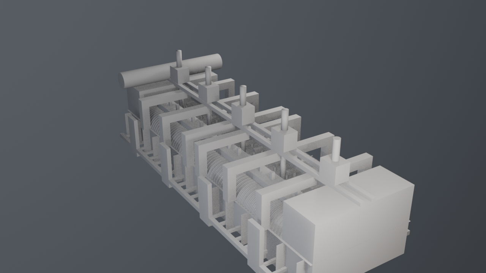

# Aluminium electrolysis cell — 3D model

A reusable, parametric **400 kA prebake Hall–Héroult aluminium reduction cell**,
built in Blender with Python. Explore the assembled cell, inspect its nine
subsystems, or animate the assembly coming apart.



**[Download the models and viewer](https://github.com/Darkamui/aluminium-electrolysis-cell-3d/releases/latest)**
· [Reuse guide](docs/REUSE.md) · [Build from source](#build-from-source) · [MIT license](LICENSE)

## Use the model

Download the model ZIP from the release page:

| File | Use |
| --- | --- |
| `cell.blend` | Editable Blender scene, materials, collections and live explosion rig |
| `cell.glb` | Static model for glTF-compatible engines and 3D applications |
| `cell_anim.glb` | Model with one baked assembly/explosion animation |
| `cuve400.html` | Interactive viewer: orbit, inspect parts, toggle subsystems, section and explode |

Open the HTML file in a modern WebGL browser. Its model is embedded, so no local
server is needed; **internet access is required for Three.js and fonts**.
The editable viewer template is [viewer/index.html](viewer/index.html).
See the [reuse guide](docs/REUSE.md) for scale, axes, naming and animation details.

## What is included

- One complete cell: shell, refractory lining, cathodes, bath and metal pad,
  anodes, busbars, superstructure, hooding and hardware.
- 757 Blender objects, 74 mesh datablocks, 17 materials and 140,556 evaluated
  triangles in the default build. Shared geometry keeps repeated parts compact.
- A reversible transverse cutaway and an explosion rig controlled by one value.
- Scripts for orthographic plates, a hero render, exploded views and MP4 sequences.
- A plain-Python dimensional datasheet and 14 Blender QA checks.

This repository contains the model and its inspection viewer. The separate
`story-narrative` educational application is not part of this project.

## Build from source

Tested with **Blender 5.2.1 LTS**. Blender includes the Python runtime needed for
modelling; a separate **Python 3.11+** installation runs the optional packaging
tools. There are no pip dependencies. Older Blender versions are not verified.

Clone this repository, enter its directory, and put Blender on your `PATH`:

```sh
git clone https://github.com/Darkamui/aluminium-electrolysis-cell-3d.git
cd aluminium-electrolysis-cell-3d
blender --background --python-exit-code 1 --python build_all.py -- --strict --save
blender --background --python-exit-code 1 --python qa/validate.py
```

On Windows PowerShell, replace `blender` with an invocation such as
`& 'C:\Program Files\Blender Foundation\Blender 5.2\blender.exe'`.

Export static and animated models, then generate the viewer:

```sh
blender --background --python-exit-code 1 --python export/glb.py -- --out out/cell.glb
blender --background --python-exit-code 1 --python export/glb.py -- --animated --out out/cell_anim.glb
python tools/embed_glb.py
```

Render images or videos (rendering takes longer than building):

```sh
blender --background --python-exit-code 1 --python build_all.py -- --strict --render all --hero --save
blender --background --python-exit-code 1 --python build_all.py -- --strict --explode 0,0.25,0.5,1 --render exploded
blender --background --python-exit-code 1 --python build_all.py -- --strict --anim all --hero --subdir videos
```

Output goes to ignored `out/`. Use `--help` after `--` for script options.
The viewer can be regenerated from a fresh clone; no previous build output is
required beyond the exported GLB.

## Fidelity and scope

The pot dimensions draw on M. Dupuis, *Thermo-Electric Design of a 740 kA Cell,
Is There a Size Limit?*, Table 1, 400 kA column. References and deviations are
documented at the top of [spec.py](spec.py). Above-rim components, including the
superstructure and hooding, use plausible engineering assumptions marked
`ASSUMED`; this is a visualization model, not a certified construction design.

The shell interior is deliberately wider and longer than the reference thermal
model to accommodate the represented feeder geometry and clearances. The
[design history](docs/DESIGN_HISTORY.md) records these decisions. Busbars and the
gas duct end in stubs; no adjoining cells or potroom equipment are included.

## Project layout

| Path | Purpose |
| --- | --- |
| `spec.py` | Dimensions, operating parameters and self-checks; no Blender dependency |
| `build_all.py` | Build, render and animation entry point |
| `modules/` | Nine independently named model subsystems |
| `lib/` | Geometry helpers, materials, explosion rig and sectioning |
| `render/`, `export/` | Cameras, lighting, video and glTF export |
| `qa/` | Blender checks for geometry, naming, materials and clearances |
| `viewer/` | Source for the interactive inspection viewer |
| `tools/`, `tests/` | Packaging tools and regression tests |

## Contributing and releases

See [CONTRIBUTING.md](CONTRIBUTING.md) for validation and release commands,
[AGENTS.md](AGENTS.md) for modelling contracts and known API traps, and
[tools/API_NOTES.md](tools/API_NOTES.md) for the tested Blender API details.
The [original modelling brief](astra_blender_electrolysis_cell_production_prompt.md)
is retained for provenance.

Original source code, generated models and renders are available under the
[MIT license](LICENSE), including modification and commercial reuse. Preserve
the license notice when redistributing. External libraries and fonts retain
their own licenses; see [THIRD_PARTY_NOTICES.md](THIRD_PARTY_NOTICES.md).
